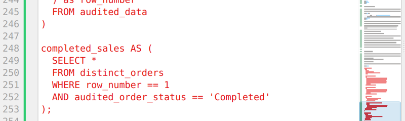

# About this project

The below SQL script is an example of the sort of approach I take with designing clean, modular and tested queries.

 

Each section was prepared individually at the column level to explore the data and identify any required transformations and or cleaning as a baseline for each column in a given table to then surface a single clean table at the end for further analysis or as the basis for joining other tables.

 

You should note that it is modular in approach, even with the extended initial query to create the audited_data table which is also labelled along the way.

 

This is actually several SQL queries in a row, hence SQL script reference not query - these feed directly off the others to produce a clean final table here with some dummy sales data that was cleaned as part of basic data analysis.

# What this script is doing

- **Part 1:** audited_data is the intial cleaning step for the raw sales data
- **Part 2:** distinct_orders is then drawing from audited_data to partition the cleaned inputs to define a unique row by a unique combination of email and product_name
- **Part 3:** completed_sales is the resultant table that is created by de-duplicating the distinct_orders table by selecting only order_status == 'Completed' so we see only completed sales.

 

A table like completed_sales is a common approach to looking at sales commissions and is where sales commissions should be based as a minimum.

 

Further refinements could be to add extra logic to test if there are any refunds or cancellations recorded even after a sale is marked as completed - if within 10 business days of a sale then perhaps that would be a trigger for a full customer refund if a 10 business day cooling off period applied for example, the implication also being to reduce the sales dashboard and not apply commission.

 
# Example script
 

```
WITH audited_data AS(
  SELECT
    order_id,
    -- Clean customer name
    INITCAP(customer_name) AS customer_name,
    email,

    -- Standardise order_status
    CASE
      WHEN LOWER(order_status) LIKE '%delive%' THEN 'Delivered'
      WHEN LOWER(order_status) LIKE '%return%' THEN 'Returned'
      WHEN LOWER(order_status) LIKE '%refund%' THEN 'Refund'
      WHEN LOWER(order_status) LIKE '%cance%' THEN 'Cancelled'
      WHEN LOWER(order_status) LIKE '%comp%' THEN 'Completed'
      ELSE 'Other'
    END AS audited_order_status,

    -- Standardise product_name
    CASE
      WHEN LOWER(product_name) LIKE '%bron%' THEN 'Bronze Tier'
      WHEN LOWER(product_name) LIKE '%silv%' THEN 'Silver Tier'
      WHEN LOWER(product_name) LIKE '%gold%' THEN 'Gold Tier'
      ELSE 'Other'
    END AS corrected_product_name,

    -- Clean quantity
    CASE
      WHEN LOWER(quantity) == 'fourty' THEN 40
        ELSE CAST (quantity AS INT64)
      END AS cleaned_quantity,

      -- Standardise date (try ISO first then US)
      COALESCE(
        SAFE.PARSE_DATE('%Y-%m-%d', CAST(order_date AS STRING)),
        SAFE.PARSE_DATE('%m/%d/%Y', CAST(order_date AS STRING))
      ) AS standardised_order_date
  FROM customer_orders
  WHERE customer_name IS NOT NULL
),

distinct_orders AS(
  SELECT *,
    ROW_NUMBER() OVER(
    PARTITION BY LOWER(email), LOWER(product_name)
    ORDER BY order_id
  ) as row_number
  FROM audited_data
)

completed_sales AS (
  SELECT *
  FROM distinct_orders
  AND audited_order_status == 'Completed'
);
```

